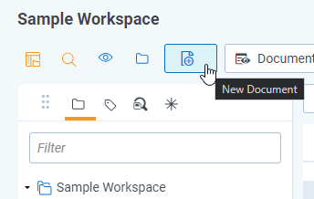

## Manual Setup Steps
1. Extract the files from [ExampleDocs.zip](./ExampleDocs.zip).
2. Import those documents into a Workspace with Relativity Contracts installed using Single-Document Import.
   * You can open the Single-Document Import menu from the Documents tab by clicking the New Document button in the top-left of the page:

      
3. Create a Saved Search with those 5 documents.
   * TIP: The easiest way to do this is to filter the Control Number column for `begins with` "EXAMPLE_00".
   * **IMPORTANT:** Make sure your Saved Search has the `Owner` field set to `Public`.
4. Navigate to the `Imaging Sets` tab and create a new Imaging Set with these field values:
   * **Data Source**: *&lt;Your Saved Search From Step 3&gt;*
   * **Imaging Profile**: Basic Default
5. Once you've saved your new Imaging Set, click the `Image Documents` button on the right side of the page.
   
6. If you get a pop-up asking if you want to hide images for QC review, make sure the box is unchecked and click `Ok` to start the Imaging job.
7. Wait for the Imaging Set to complete.
8. Once your Imaging Set is complete, make sure your environment is set up to run Contracts OCR Sets:
   * Ensure there's at least one `Contracts OCR Agent` is enabled.
   * In the `Resource Files` tab, make sure there's a file called `heretik.model` associated with the Contracts application.
     * If the file doesn't exist, reach out to support to get it.
9. Navigate to the `Contracts OCR Sets` tab in your Workspace and create a new Contracts OCR Set using your Saved Search as the **Data Source**.
10. Once you've saved your Contracts OCR Set, click the `Run OCR` button on the right side of the page to start the Contracts OCR job:
    
11. Wait for the Contracts OCR job to complete.